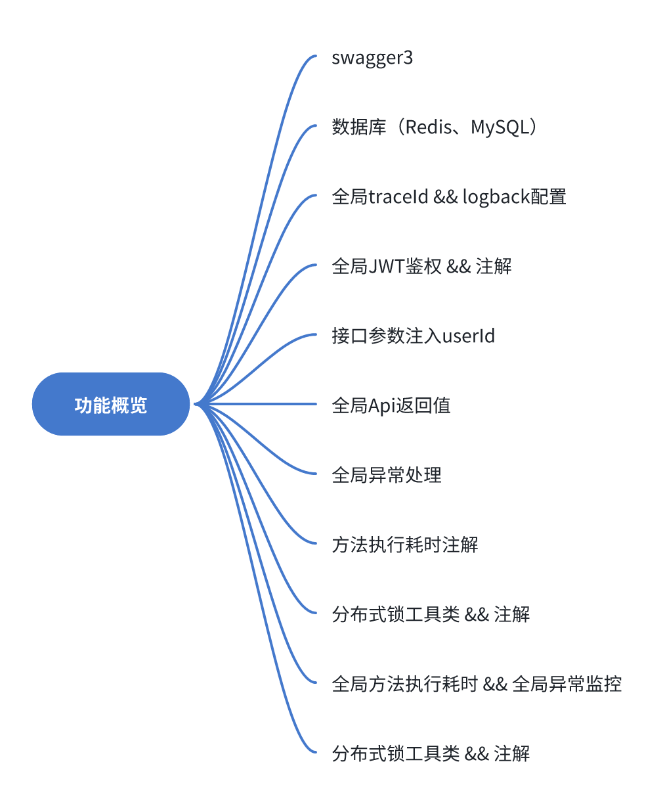

# 功能介绍
- &#10003; swagger http://localhost:10001/doc.html#/home
- &#10003; 数据库（Redis、MySQL）
- &#10003; 全局TraceId
- &#10003; JWT鉴权
- &#10003; 全局Api返回值
- &#10003; 全局异常处理
- &#10003; 方法执行耗时注解
- &#10003; 分布式锁工具类 && 注解
- &#10003; 全局方法执行耗时 && 全局异常监控
- &#10003; 分布式锁工具类 && 注解

# git停止追踪文件

如果logs文件夹已经被git跟踪，你需要先使用git rm --cached -r logs/命令来停止跟踪这个文件夹，然后再添加.gitignore规则